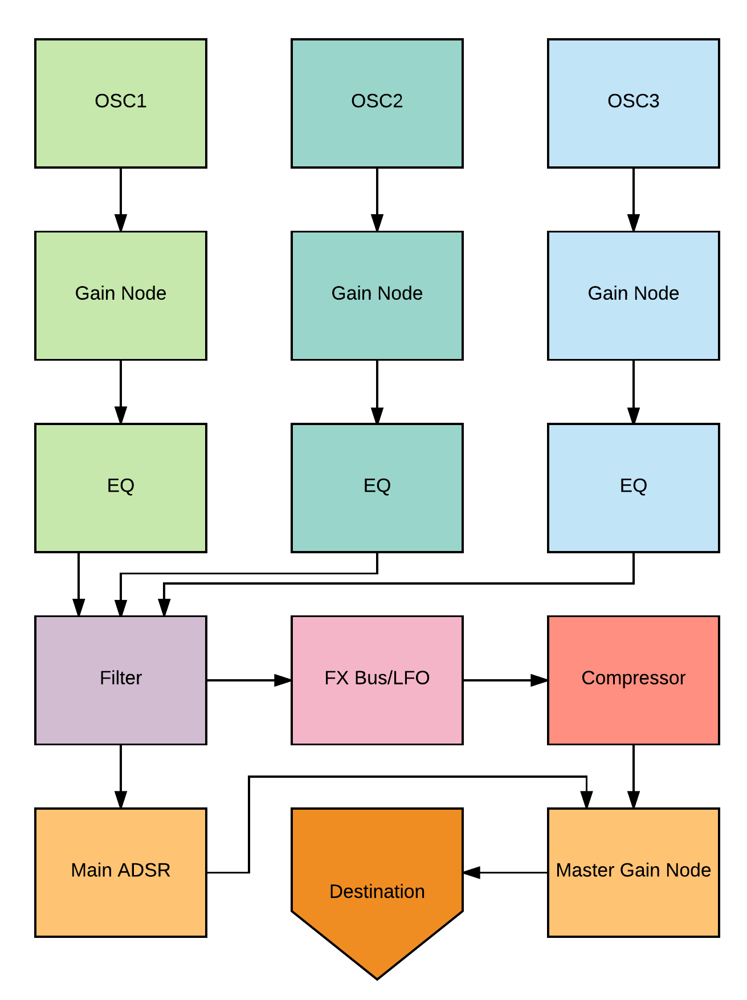

# KNETIC (Web Audio Synthesizer) (Server)

Knetic is a web based audio synthesizer that utilizes the Web Audio and MIDI API's. Knetic uses React on the frontend, Tuna.js for audio effects and is wrapped in Electron.

This repository is home to Knetic.

## Related Repositories

* [SERVER](https://github.com/KNETIC-KRPF/KNETIC-SERVER) - KNETIC Server, MongoDB, Monk, Express, Node.js
* [CLIENT](https://github.com/KNETIC-KRPF/KNETIC-CLIENT) - KNETIC Client, React, Web Audio API, Web MIDI API, Tuna.js, Electron, CSS Grid

## Prerequisites

MongoDB
```
brew update

brew install mongodb

mkdir -p /data/db

mongod
```
If your PATH doesn't include the location of mongod binary, enter the path in the system prompt
```
<path to binary>/mongod
```
If you are not using the default data directory (/data/db) specify using the <code>--dbpath</code>
```
mongod --dbpath <path to data directory>
```
Set up your local mongodb databse
```
mongod --dbpath=/data --port 27017
```
Set your MONGODB_URI in your .env to the local mongodb you've created (i.e., 'localhost:27017/myproject').

In your project folder, in the command line, run ```node seed.js```

## Getting Started

These instructions will get you a copy of the project up and running on your local machine for development and testing purposes.

### Getting Started

To get running locally, fork & clone or clone this repository.

This repository is dependent on the following repositories:
* [SERVER](https://github.com/KNETIC-KRPF/KNETIC-SERVER)
* [CLIENT](https://github.com/KNETIC-KRPF/KNETIC-CLIENT)

From the command line run the following:

```
git clone git@github.com:KNETIC-KRPF/KNETIC-SERVER.git

cd ./KNETIC-SERVER

npm install

npm start
```
## Built With

* [Node.js](https://nodejs.org/en/) - JavaScript Runtime/Dependency Management.
* [Express](https://expressjs.com/) - Minimal and flexible Node.js web application framework that provides a robust set of features for web and mobile applications.
* [MongoDB](https://www.mongodb.com/) - Non-relational database
* [Monk](knexjs.org/) - A tiny layer that provides simple yet substantial usability improvements for MongoDB usage within Node.JS.

## Authors

* **Jacob Feldman** - *Initial work* - [Jacob Feldman](https://github.com/jakeFeldman)
* **Matt Pitts** - *Initial work* - [Matt Pitts](https://github.com/mattpitts)
* **Alex Read** - *Initial work* - [Alex Read](https://github.com/alexread730)
* **Ross Kiser** - *Initial work* - [Ross Kiser](https://github.com/kiserr10)

## License

This project is licensed under the MIT License - see the [LICENSE.md](LICENSE.md) file for details


Database ERD:


